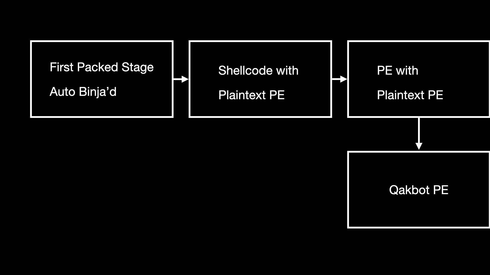

# Automating Qakbot Unpacking and Analysis with Binary Ninja

## Stream January 22 2024

### Binary Ninja Automation Development

* We used `binaryninja.highlevelil.HighLevelILFunction.visit` to recursively enumerate function instructions to find our target HLIL call parameter (encryption key) [https://api.binary.ninja/binaryninja.highlevelil-module.html#binaryninja.highlevelil.HighLevelILFunction.visit](https://api.binary.ninja/binaryninja.highlevelil-module.html#binaryninja.highlevelil.HighLevelILFunction.visit) - we should strip out all of our fingerprinting code and just use recursion next stream

* We found that LIEF is probably better for enumerating PE resources than pefile [https://lief-project.github.io/doc/latest/tutorials/07_pe_resource.html](https://lief-project.github.io/doc/latest/tutorials/07_pe_resource.html) - will be fixing resource extraction code next stream

* Jordan [https://twitter.com/psifertex](https://twitter.com/psifertex) provided additional helpful links for batch processing [https://docs.binary.ninja/dev/batch.html](https://docs.binary.ninja/dev/batch.html)

Current state of our automation code: [extract_qakbot.py](scripts/extract_qakbot.py)

### Unpacking Qakbot and Analysis using Binary Ninja

* We manually unpacked Qakbot by decrypting the first stage and then manually carved the subsequence PE stages, shown here:

We began analyzing the dynamic function resolution logic using Binary Ninja in Qakbot, and will work on automated function identification (through hash comparisons) and markups of function tables next stream.

## Stream February 3 2024

* Cleaned up code to only include recursive technique that Jordan showed us last stream
* Fixed resource extraction code and wrote XOR code for decrypting resource
* Confirmed Binary Refinery carve-pe works for carving second and third stage DLL
`emit binja-decrypted-shellcode.bin | carve-pe | carve-pe > third-dll`
* CTNordgaren cool tool for analyzing memory dumps: https://github.com/vswarte/memory-mirror
* Smart-structures in Binary Ninja: https://docs.binary.ninja/guide/type.html#smart-structures-workflow
* Discovered sample that ussing the same packer as Qakbot but uses indirect syscalls to map and execute a third-stage DLL `0d5af47bde7fdbb370d48611fd5800ec9be785aa77e1fca4badd4d2d3647447d` in memory. We ran into issues with being unable to import arbitrary type information for our shellcode in order to mark up the Windows strucutres.
* Current state of our automation code: [extract_qakbot.py](scripts/extract_qakbot.py)
* We made the following changes: [https://github.com/Invoke-RE/stream-notes/commit/8b6ec718610a00a47ead83c444a130276ef6c603#diff-f483a6a64ac50d93bbbf888e8bab17e7723c01a7da66e4b02f16f278cadc5837](https://github.com/Invoke-RE/stream-notes/commit/8b6ec718610a00a47ead83c444a130276ef6c603#diff-f483a6a64ac50d93bbbf888e8bab17e7723c01a7da66e4b02f16f278cadc5837)

