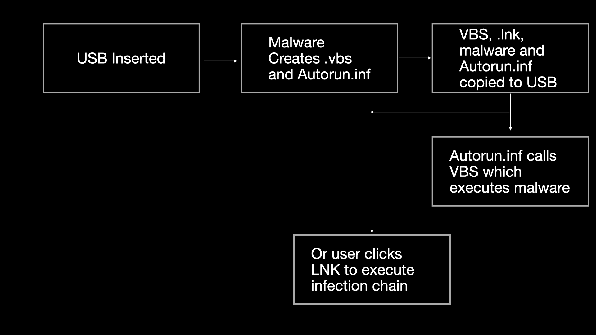

# Beginner Streams

## Sample Analyzed

* `75d4e24d52a18ef64488fe77b0f6b713ce4b1a484156a344f5cc84fce68e7512`

## Stream March 02 2024

## Stream March 16 2024

### Auto-Unpacking

* Tried using [mal_unpack](https://github.com/hasherezade/mal_unpack) to auto-unpack sample
* Let sample inject and used [hollows_hunter](https://github.com/hasherezade/hollows_hunter) to carve and unmap sample
* Showed that you can also use [unpac.me](https://www.unpac.me/results/fc553fef-7d78-4cb7-9c53-4f6be81f4d07#/) to unpack all sample stages and automatically identify Phorpiex

### Automating IOC Extraction and Malware Identification

* Used [AssemblyLine](https://cybercentrecanada.github.io/assemblyline4_docs/) to automatically extract IOCs and identify Phorpiex sample

### Conditional Breakpoints in x64dbg for Unpacking

* Edit breakpoint condition for a particular unpacking API to contain an MZ header. For example, for `WriteProcessMemory` we can do something like: `2:[[ESP+0xC]] == 0x5A4d`

### LLM Reversing / Static Analysis

* Used [Binary Ninja Sidekick](https://sidekick.binary.ninja/) to assist us in automatically reverse engineering many different components of this malware at a high level. Played with multiple techniques (function renaming, variable naming etc.) to assist the LLM with function identification.
